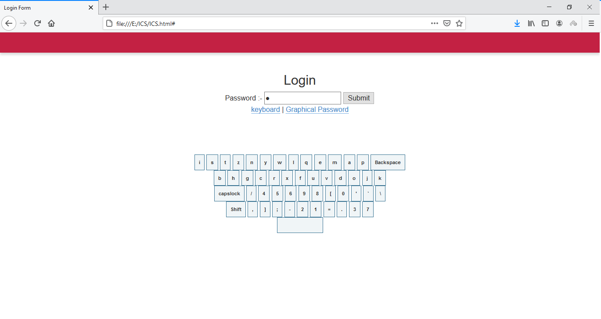
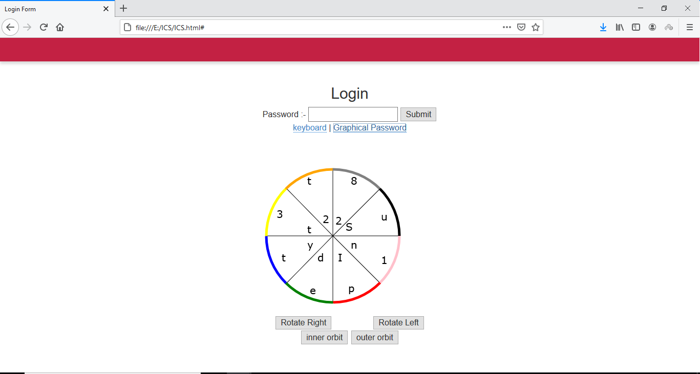
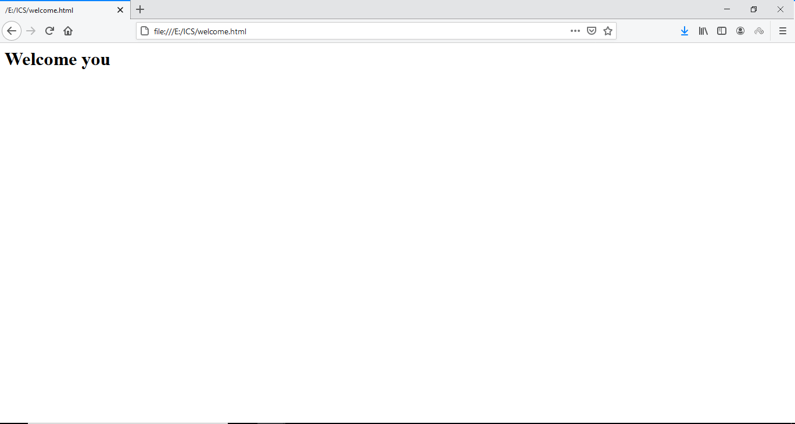

# Virtual-Keyboard-and-graphical-password

virtual keyboard and graphical password: password entering strategy.

Use: password entering strategies to prevent password attacks.

To start the project double click on ICS.html

Strategies:

- virtual keyboard
- graphical password

  1.virtual keyboard: When entering private data (for example, your login and password for an online banking account) from a regular keyboard,
  there is always a risk of data interception by some spyware. Such programs record the keys pressed on the keyboard and therefore capture the
  data entered from the regular keyboard to pass it to the malefactor.
  To enter the information with the virtual keyboard:

      i.   Position the cursor over the required field.
      ii.   Enter the data, mouse-clicking on the virtual keyboard buttons

Vitual Keyboard:

2.graphical password: you have to choose a color while registration. Later you can use graphical password to avoid shoulder surfing. shoulder
surfing is spying on the user of a cash-dispensing machine or other electronic device in order to obtain their personal identification number, password, etc.
To enter the information with graphical password:

    i.   rotate the circle by using appropriate buttons. (i.e. rotate left and rotate right.)
    ii.   use inner orbit button to select inner element and outer orbit button for outer element.

Graphical password:

password accepted:

Default color : Red

Default Pass : Aashu348
